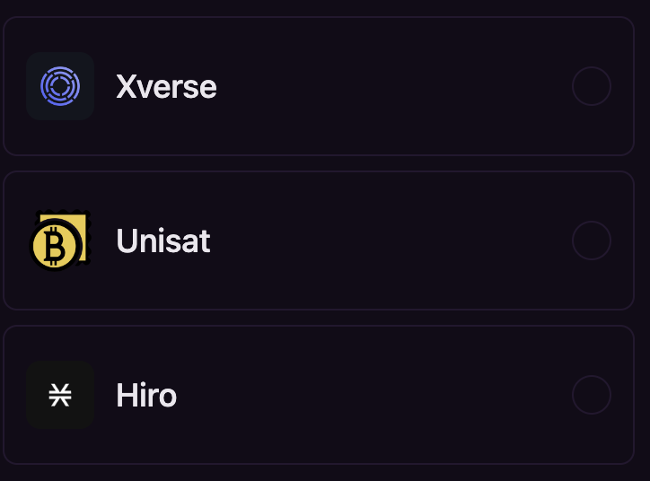
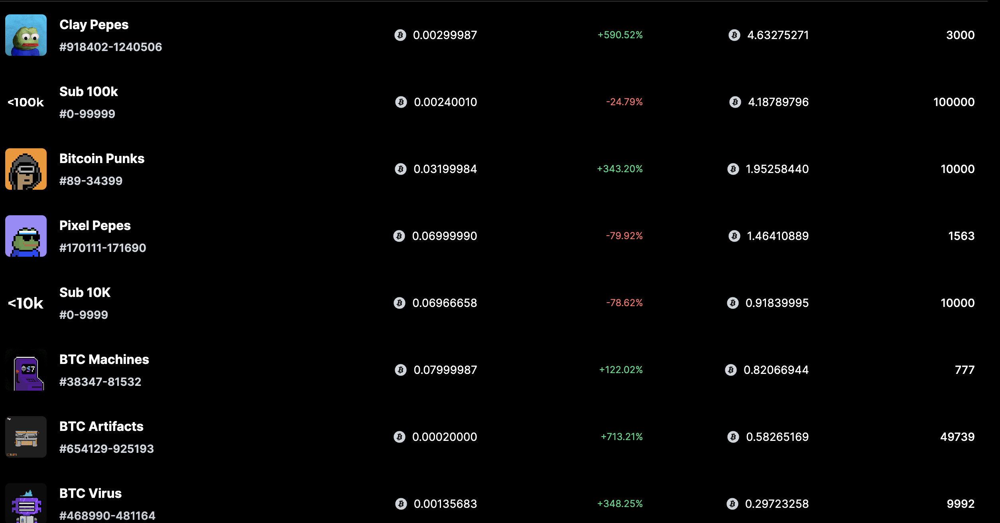

# blogs
## 产品简介
Inscribe, discover, buy & sell the best and latest Bitcoin NFTs on the the leading community-centric Bitcoin NFT marketplace --- Thords.io
[regtest network](https://app.regtest.thords.io/)

## 产品亮点
[Key features](./product/highlights.md)

## 市场现状
### 钱包
浏览器钱包有xVerse，unisats和hiro

### 项目方
可参考[ordinalswallet](https://ordinalswallet.com/collections和[magic eden](https://magiceden.io/ordinals)

### 交易平台
- [Ordinalswallet](https://ordinalswallet.com/): NFT collection)
- [Magic Eden](https://magiceden.io/ordinals)
- [Ordswap](https://ordswap.io/):只有单个NFT的交易，没有对NFT进行Collection的聚合
- [Unisat](https://unisat.io/): 主打域名和BRC-20交易
- [Gama](https://gamma.io/ordinals)
- Thords.io: 新兴的交易平台，mint，buy手续费全网最低，且有全面的链上数据索引

### 数据分析
- [ordinalhub](https://www.ordinalhub.com/)
- [ord.io](https://www.ord.io/)
- [ordscan](https://ordiscan.com/)

## 沉淀的内容
- [Ordinal NFT实现原理及Bitcoin Regtest测试网Mint教程](https://learnblockchain.cn/article/5376)
- [深度分析Ordinals系列:Inscribe](./inscribe/%E5%85%A8%E9%9D%A2%E6%80%BB%E7%BB%93Oridinals%E7%94%9F%E6%80%81Insribe%E7%9A%84%E5%A4%A7%E5%B0%8F%E5%92%8C%E6%A0%BC%E5%BC%8F%E9%99%90%E5%88%B6%E5%8F%8A%E8%B4%B9%E7%8E%87.md)
- [Ordinals数据趣事](./datastory/ordinals%20story.md)
- [Dapp learning分享:Understanding the basic ideas and features behind Bitcoin NFT](https://twitter.com/Dapp_Learning/status/1624676639409074178)

## 团队背景
- Po, R&D: 某985高校博士，主要负责Ord相关底层协议研发.
- PayFv, CTO: 10多年互联网从业经验，曾在腾讯、恒生电子等公司工作，作为架构师构建过亿级TPS的春晚摇一摇红包业务，在区块链领域也有三年经验，技术涉及智能合约、Substrate开发等
- 1px, 产品经理: 10多年互联网从业经验，曾任职腾讯地方站产品总监。
- Cyber Elaina, 运营总监: 某Top5 高校研究生，有4年运营经验，曾参与比特大陆IPO，在Matrixport做金融产品运营。
