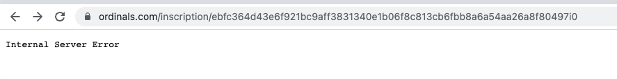
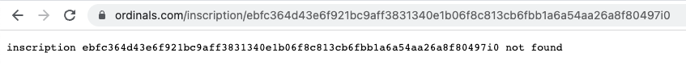
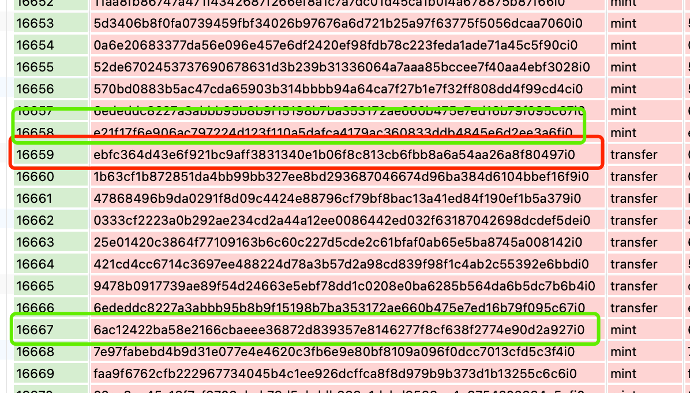
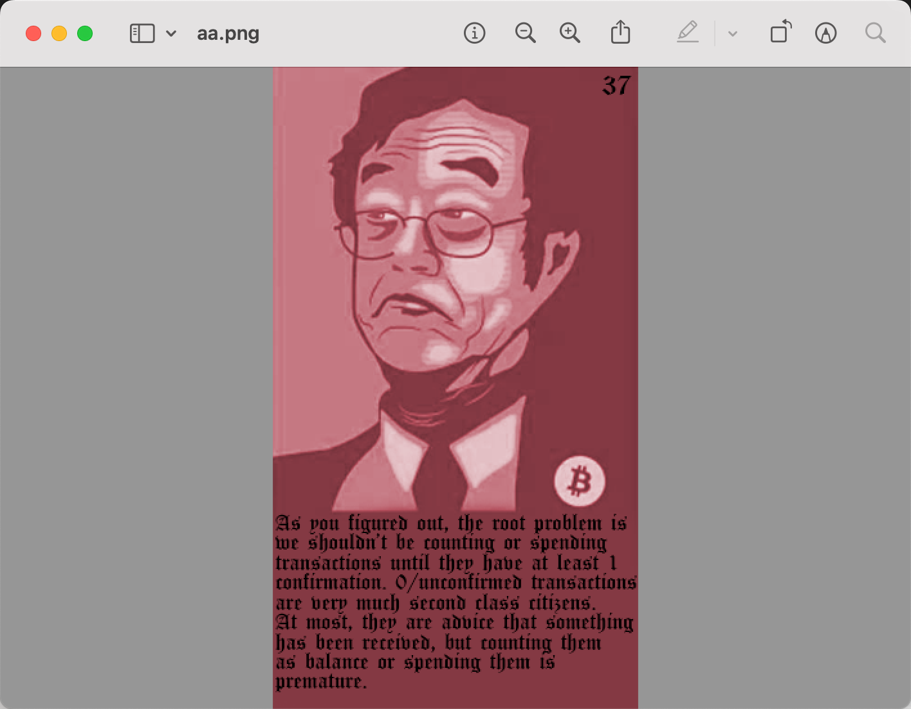
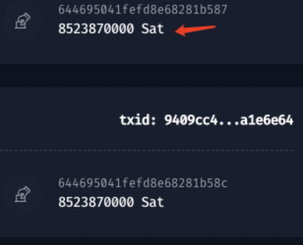
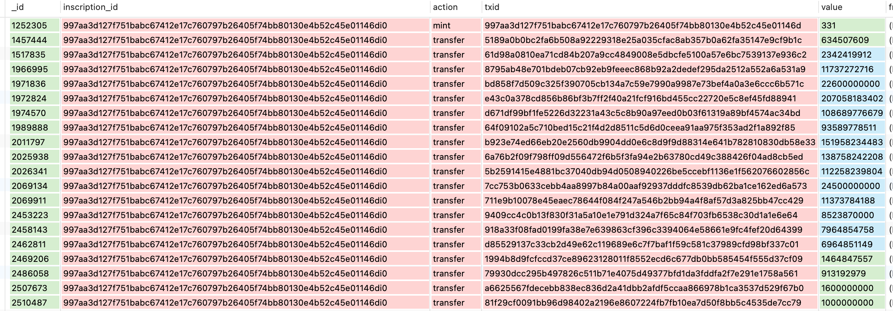

# Ordinals 数据趣事

大家好，我是 thords.io 的开发者 PayFv，负责 Ordinals 数据清洗和索引相关工作。

由于工作内容的原因，得到了很多关于 Ordinals 的数据，比如第一笔发生 Transfer 的交易，第一笔发生 Trade 的交易，当 100 万个 Inscription 被 Inscribe 出来时，一共产生了多少笔 Transfer，当时交易最活跃的交易平台是谁等等。所以本篇内容，将和各位看官分享一些目前工具无法或较难查询到数据信息。

### Inscription#0 的旅程

[Inscription#0](https://ordinals.com/inscription/6fb976ab49dcec017f1e201e84395983204ae1a7c2abf7ced0a85d692e442799i0) 截止到2023 年 4 月 24 日发生了两次转移，一共产生了三个Event log（包含 Inscribe event），分别是：

- Event#0 发生在 2022-12-14 20:32:00 ，创建并分配给了 [bc1qv8zhcjzpjw4m4tdyc5zn3dmax0z6rr6l78fevg]([mempool - Bitcoin Explorer](https://mempool.space/address/bc1qv8zhcjzpjw4m4tdyc5zn3dmax0z6rr6l78fevg))。当时 Inscription#0 中包含 9678 sats。

- Event#1 发生在 2023-04-14 18:33:56 ，由 [bc1qv8zhcjzpjw4m4tdyc5zn3dmax0z6rr6l78fevg]([mempool - Bitcoin Explorer](https://mempool.space/address/bc1qv8zhcjzpjw4m4tdyc5zn3dmax0z6rr6l78fevg)) 转给了 [bc1pt4lxzcyc3k9yn3frv3fmeycycqj724zdr8z6qjh4twhdp72slmusagr8v4]([mempool - Bitcoin Explorer](https://mempool.space/address/bc1pt4lxzcyc3k9yn3frv3fmeycycqj724zdr8z6qjh4twhdp72slmusagr8v4)) 。转移的过程中，Inscription#0 的 sats 只留下了 4128 sats，5550 sats 被作为矿工费支付给了矿工。这是一个很有意思的处理思路，以后大家在转移 Inscription 时，当 Inscription 中的sats 足够且Inscription 所处的 sat 位置较理想时，可以考虑直接由 Inscription 中多余的sats作为矿工费。此笔事件的 txid 为 [2c8a11858825ae2056be90c3e49938d271671ac4245b452cd88b1475cbea8971]([mempool - Bitcoin Explorer](https://mempool.space/tx/2c8a11858825ae2056be90c3e49938d271671ac4245b452cd88b1475cbea8971))

- Event#2 发生在 2023-04-14 19:06:04，由 [bc1pt4lxzcyc3k9yn3frv3fmeycycqj724zdr8z6qjh4twhdp72slmusagr8v4]([mempool - Bitcoin Explorer](https://mempool.space/address/bc1pt4lxzcyc3k9yn3frv3fmeycycqj724zdr8z6qjh4twhdp72slmusagr8v4)) 转给了 [bc1pz4kvfpurqc2hwgrq0nwtfve2lfxvdpfcdpzc6ujchyr3ztj6gd9sfr6ayf]([mempool - Bitcoin Explorer](https://mempool.space/address/bc1pz4kvfpurqc2hwgrq0nwtfve2lfxvdpfcdpzc6ujchyr3ztj6gd9sfr6ayf))。这里 Inscription 的 sats 又给补充到了 10000sats。此笔事件的 txid 为 [bc4c30829a9564c0d58e6287195622b53ced54a25711d1b86be7cd3a70ef61ed]([mempool - Bitcoin Explorer](https://mempool.space/tx/bc4c30829a9564c0d58e6287195622b53ced54a25711d1b86be7cd3a70ef61ed)) 。

## 无效且有效的 Inscription

我们在比对数据时，会发现一些无法解析的Inscription，比如 [ebfc364d43e6f921bc9aff3831340e1b06f8c813cb6fbb8a6a54aa26a8f80497]([mempool - Bitcoin Explorer](https://mempool.space/tx/ebfc364d43e6f921bc9aff3831340e1b06f8c813cb6fbb8a6a54aa26a8f80497)) , 

[1b63cf1b872851da4bb99bb327ee8bd293687046674d96ba384d6104bbef16f9]([mempool - Bitcoin Explorer](https://mempool.space/tx/1b63cf1b872851da4bb99bb327ee8bd293687046674d96ba384d6104bbef16f9)) 。他们对应的 Inscription ID 分别是 [ebfc364d43e6f921bc9aff3831340e1b06f8c813cb6fbb8a6a54aa26a8f80497i0](https://ordinals.com/inscription/ebfc364d43e6f921bc9aff3831340e1b06f8c813cb6fbb8a6a54aa26a8f80497i0) 和 [1b63cf1b872851da4bb99bb327ee8bd293687046674d96ba384d6104bbef16f9i0](https://ordinals.com/inscription/1b63cf1b872851da4bb99bb327ee8bd293687046674d96ba384d6104bbef16f9i0) ，在 ord server的服务中，得到的结果是  "Internal Server Error" 的错误提示，如图：

而当 Inscription 不存在时，返回则是 "inscription ebfc364d43e6f921bc9aff3831340e1b06f8c813cb6fbb1a6a54aa26a8f80497i0 not found" 的内容，如图：

由此，我们认为这可能会是有效的 Inscription。为了确认这类情况的 Inscription 是否会占用 ordinals，我们将其中一笔交易的前后 Inscribe 记录挑选了出来，比对他们 ordinals的分配情况。

从我们解析出的数据中可以看到，在 ebfc364d43e6f921bc9aff3831340e1b06f8c813cb6fbb8a6a54aa26a8f80497i0 的前一笔 Inscribe 和 后一笔 Inscribe 分别是 [e21f17f6e906ac797224d123f110a5dafca4179ac360833ddb4845e6d2ee3a6fi0](https://ordinals.com/inscription/e21f17f6e906ac797224d123f110a5dafca4179ac360833ddb4845e6d2ee3a6fi0) 和 [6ac12422ba58e2166cbaeee36872d839357e8146277f8cf638f2774e90d2a927i0](https://ordinals.com/inscription/6ac12422ba58e2166cbaeee36872d839357e8146277f8cf638f2774e90d2a927i0) ，他们对应的 Inscription Number 分别是 **#13815** 和 **#13816**。

显然，[e21f17f6e906ac797224d123f110a5dafca4179ac360833ddb4845e6d2ee3a6fi0](https://ordinals.com/inscription/e21f17f6e906ac797224d123f110a5dafca4179ac360833ddb4845e6d2ee3a6fi0)并没有占用 ordinals ，此案告破，这类交易在我们的索引服务中也选择了忽略。

不过，我们尝试了解析这笔tx，在我们的解析服务中是可以成功解析出来结果了，他的 content-type 是 image/png 。我们人工介入恢复了Inscription的内容。^_^。

但为什么没有进入 Oridnals ，团队的其他小伙伴作为次要任务记录下来了，有结果后再和大家分享。

## 被迫升值的 Inscription

这件事发生在写这边文章的时候，当时团队的小伙伴们正在优化 Event Log 的展示体验，发现了这么多笔异常的交易，异常点在于 Inscription 中包含的 sats 非常非常多。一共有85.2387 个 BTC。

为了弄清是不是解析服务错了，我们对这笔交易展开了调查。调查的过程很简单，查看了这个交易的第一次升值后，发现该 Inscription 所在的 UTXO 被作为矿工费支付出去了。下面将展示这笔 Inscription 的详细信息。

Inscription ID: [997aa3d127f751babc67412e17c760797b26405f74bb80130e4b52c45e01146di0](https://ordinals.com/inscription/997aa3d127f751babc67412e17c760797b26405f74bb80130e4b52c45e01146di0)

Inscribe Tx: [997aa3d127f751babc67412e17c760797b26405f74bb80130e4b52c45e01146d]([mempool - Bitcoin Explorer](https://mempool.space/tx/997aa3d127f751babc67412e17c760797b26405f74bb80130e4b52c45e01146d))

Last Tx: [81f29cf0091bb96d98402a2196e8607224fb7fb10ea7d50f8bb5c4535de7cc79]([mempool - Bitcoin Explorer](https://mempool.space/tx/81f29cf0091bb96d98402a2196e8607224fb7fb10ea7d50f8bb5c4535de7cc79))

下面图表中，是我们解析的关于 997aa3d127f751babc67412e17c760797b26405f74bb80130e4b52c45e01146di0 所有的 Event，以及Inscription所在 UTXO 的 sats 变化情况：

通过筛选，发现将 Inscription 作为矿工费发送的情况非常非常多，各位参与 Ordinals 的小伙伴，请尽量使用支持 ordinals 的钱包交易，不要使用传统的钱包参与 ordinals 投资。
