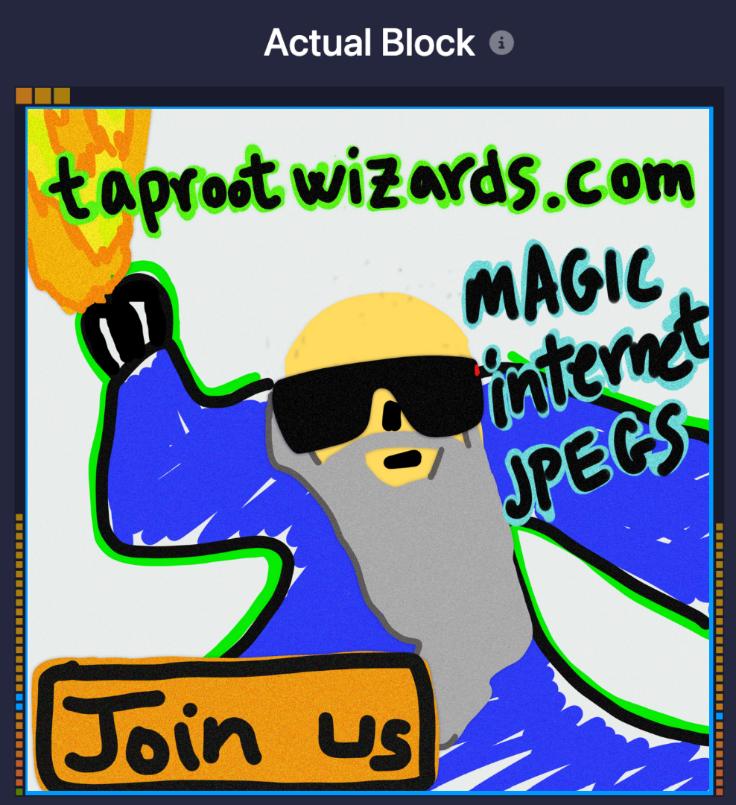
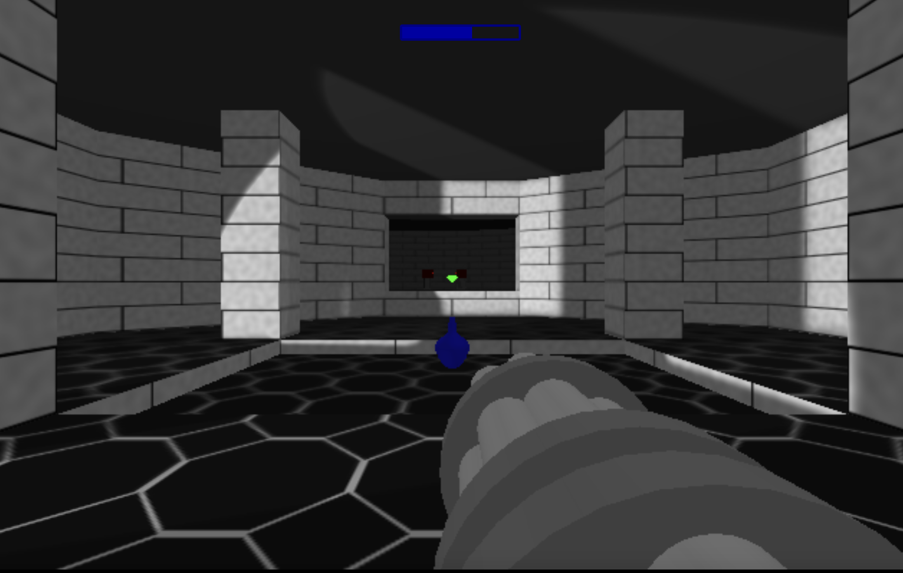
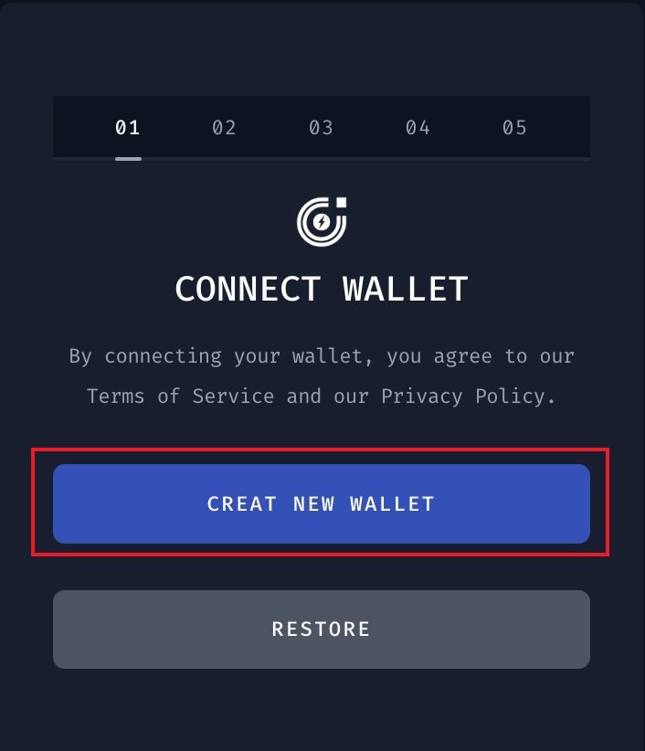
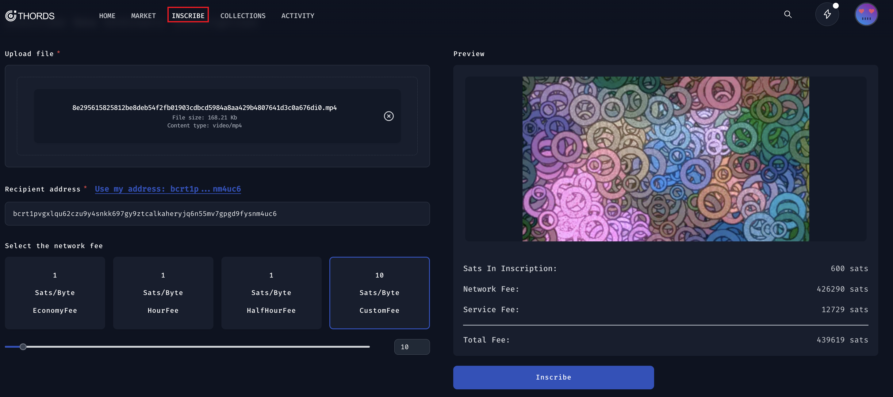

# Ordinal生态Inscribe的技术探索

## 背景
Ordinal 作为BTC上最新的生态，启动数月时间就受到了市场的热烈追捧，Inscriptions120多万的Inscribe数量足以说明其火爆程度。但是由于没有像Metamask那样成熟的浏览器钱包，Ordinal生态本身mint的交互与以太坊生态也有很大不同，整个生态的工具也比较匮乏，因此普通用户一开始参与进来的门槛还是很高的。
在2月份的时候关注到了Bitcoin NFT Ordinals就对其很感兴趣，在对其基本的技术原理研究后，对此非常感兴趣，于是就拉着小伙伴一起成立了团队[Thords Labs](https://thords.io)开始开发Ordinals NFT的marketplace相关的基础设施，其中要解决的两个核心问题就是如何创建Inscription(即Bitcoin NFT)以及如何构建marketplace，本文关注的则是Inscription创建过程Inscribe(即mint)。Oridinals NFT是直接存储在bitcoin上的，早期Inscribe需要运行Bitcoin全节点，成本很高；随着开发者们对Ordinals的认识不断加深，则出现了第三方的代Inscribe工具，比如ordinalbot、trygamma、ordswap等平台，还有针对于bitcoin域名细分领域则还有unisat。但是我们在开发的过程中发现目前这些平台其实都是基于代mint的方式，用户需要信任平台讲Inscription转给自己，团队经过不断探讨提出了一种不需要全节点、不需要代mint的用户自签名Inscribe的方式。
本文首先总结现有Inscription本身的大小和格式限制，及Inscribe工具的基本方法，最后对我们团队提出的完全去中心话的Inscibe方法基本原理进行介绍。文末有彩蛋，不要错过哦～
## Inscriptionde 工具现状
### NFT文件大小限制
刚开始我们团队对所有平台的Inscribe功能进行了体验，这些平台Inscribe的图片大小限制在300～380kb左右，这让我们很困惑。因为很早的时候读到Taprootwizard这个项目第一个NFT[Insciption #655](https://ordinals.com/inscription/0301e0480b374b32851a9462db29dc19fe830a7f7d7a88b81612b9d42099c0aei0)有3.9M，几乎占据了一整个区块大小的，并且所以理论上来说，bitcoin单个交易的最大weight为4 million，即1,000,000vByte，那么似乎Inscribe允许的大小应该略小于1M，所以一开始我们还以为是平台的限制。

但是当我们尝试在regtest测试网Inscribe超过400kb的图片时，广播交易会报错`sendrawtransaction RPC error: {"code":-26,"message":"tx-size"}`,这又是为何？
通过进一步继续查阅bitcoin文档发现，bitcoin节点实际上默认只支持广播`MAX_STANDARD_TX_WEIGHT=400,000`的交易，那么加上隔离见证交易中witness所需的weight只有普通交易的1/4，那么实际上支持的文件会小于400kb，再扣除交易中所需的签名和输出信息等，基本上最多允许的也就是380kb。这也说明了taprootwizard应该是得到了矿工的特殊支持才Inscribe了一整个区块。

### 支持的NFT文件格式
除了大小限制外，Inscription支持的格式也很有意思，除了图片外，Ordinals官网又非常多有意思的Inscription，比如[Inscription #466](https://ordinals.com/inscription/521f8eccffa4c41a3a7728dd012ea5a4a02feed81f41159231251ecf1e5c79dai0)是一个非常简单的html射击小游戏，玩起来感觉像是回到了小时候玩坦克大战的感觉；还有很多有意思的gif动图，音视频等。


我们就很好奇，Oridinals支持Inscribe哪些格式呢？
通过查阅Ord的项目源码发现，官方的代码中支持这些格式：
```
.json, .pdf, .asc, .flac, .mp3, .wav, 
.apng, .avif, .gif, .jpg, .jpeg, .png, .svg, .webp, 
.glb, .stl, .html, .txt, .mp4, .webm
```
但实际上，这些格式只是根据文件后缀名来判断的，如果想Inscribe其他文件格式只需修改后缀名即可，只是在网页上不能正常显示。这里我们有个想法就是，既然Ordinals支持的是网页端的预览格式是网页端的，那么实际上可以支持HTTP协议中常见的[MEME type类型](https://developer.mozilla.org/en-US/docs/Web/HTTP/Basics_of_HTTP/MIME_types)，这样可以进一步拓展Ord支持的NFT文件格式。

### 普通用户如何Inscribe？
上述两个问题弄清楚之后，我们继续研究了下目前市面上这些平台inscribe的方法，他们的基本原理是一致的，即用户上传NFT文件并把btc发送给平台的p2tr地址(基于此文件和平台保管的私钥tweak形成)，然后平台基于ord自身提供的命令行工具，利用自己的钱包代Inscribe并将其转移给用户提供的接收地址。以下面这两笔交易为例，ord的inscribe基于tapscript实现，花掉taproot script path即为Inscribe，需要分为两步实现:

1. 构造[commit交易](https://mempool.space/tx/6aa94f28dbe769bcdffbfbd32245708c4129ede8c82c336b49a5b9558fe2d066#vout=0).在commit交易中，用户花费自己的UTXO将其分别转给了平台代Inscribe的p2tr地址、平台的手续费地址和用户的找零地址.
2. 构造[reveal交易](https://mempool.space/tx/a0186ac57bae29728007bb9a2313c72f221b6442688b0422dd67b89b09837d08#vin=0)。在reveal交易中，平台将实际的签名和inscription file构成的script、验证script path构成的control block作为witness输入到commit交易中生成的第1个UTXO中，并将其转给用户提供的recipient address。

这类Inscibe方式带来的好处就是用户只需要签名一次，用户体验较好，但是弊端在于依赖平台对reveal交易进行签名，这会引入一些安全风险，即需要信任平台能够妥善保管好其控制的钱包。当然，由于早期基础设施也不成熟，大家都在摸索的过程中，为了快速向市场推出可行的产品，这也是当时最理想的实现方式。

实际上更安全的方式是两笔交易都由用户自己签名，并可通过对这两笔交易进行一次签名，来同时确保安全性和用户体验。我们团队深入研究ord的规范和源码，发现这条路径是可行的。

## 更安全的Inscribe方案
采用去中心化的方式去Inscribe需解决的核心问题是，用户如何在前端对这两笔交易签名。由于ord没有提供这样的API接口，我们只能完全从零开始编写代码，通过对Ord现有的Inscribe规范进行了分析，我们实现了一套完全兼容Ord的JS-SDK，使得用户可以直接在前端构造这两笔交易，并进行签名和交易广播。这种方式实现了用户**不需要自建全节点，就可以完全去中心化的Inscribe**，具有成本低且安全的优点。

此外，我们花了一些时间对交易手续费进行了模拟计算，由于手续费估算准确，相对于其他平台根据字节数预估手续费的方式，我们(Thords)实现了交易费率一致的情况下，当前市场上最低的手续费，和当前市场上手续费最低的Unisat平台基本。下图是Fee rate分别为5 sats/vB和15 sats/vB的各平台手续费的对比(数据来源于Unisat和Ordinalswallet，Total fee为commit和reveal交易的所有费用之和):


### Regtest测试网免费体验
这个方案是不是听起来是不是很复杂？没关系，我们团队已经实现了这一整套Inscibe网页，感兴趣的小伙伴可以在我们的[测试网](https://app.regtest.thords.io/)上体验:
1. [创建钱包](https://app.regtest.thords.io/create-wallet)
 
2. faucet 1 BTC on your [profile page](https://app.regtest.thords.io/profile)

3. [inscribe nft 💯](https://app.regtest.thords.io/inscribe)


此外，我们还实现了主网Inscription的数据索引，可以识别出项目方/创作者的地址，从而可以实现版税功能，期望后续像以太坊生态那样更好地激励Creators，来壮大整个Bitcoin NFT的生态。
## Contact Us
> 🎁🎁🎁 我们将为项目方提供体验更好的批量Inscribe工具，
> 欢迎项目方到我们平台来进行体验，限定前5个项目方Inscribe打2折🚀🚀🚀 。
- [Twitter](https://twitter.com/thordsio)
- [Discord](https://discord.gg/yNYyHT9z4a)
