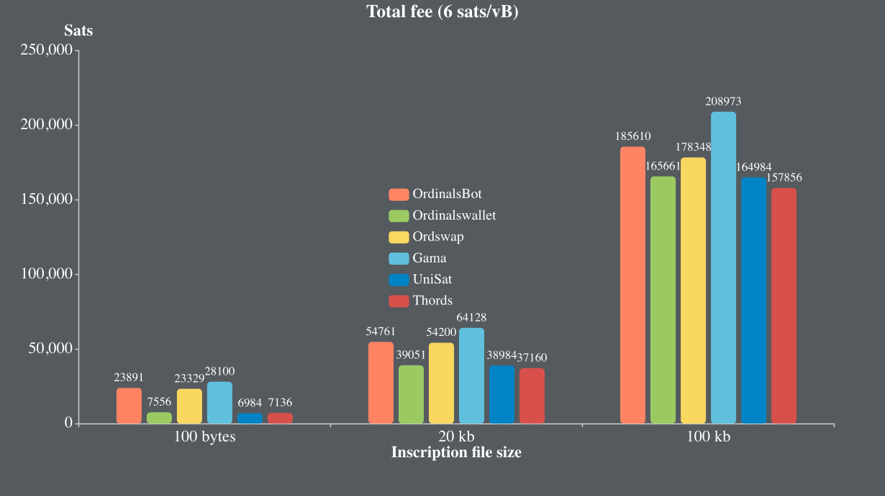

# 全面总结Oridinals生态Insribe的大小和格式限制及费率等现状
截止到目前Ordinal Inscriptions一共有120多万个了，作为普通用户而言，其实一直想跃跃欲试，早期整个生态非常缺乏Inscribe的工具，还需要运行bitcoin的全节点，成本很高；后来则出现了第三方的代Inscribe工具，比如ordinalbot、trygamma、ordswap等平台，还有针对于bitcoin域名细分领域则还有unisat。
## Inscibe file的大小限制是多少？
当我开始在这些平台上Inscribe的时候，给我带来的第一个困惑就是很多平台Inscribe的图片大小限制在只有300～380kb左右。因为很早的时候读到Taprootwizard这个项目Inscribe了一整个区块大小的[Insciption #655](https://ordinals.com/inscription/0301e0480b374b32851a9462db29dc19fe830a7f7d7a88b81612b9d42099c0aei0)，并且所以理论上来说，bitcoin单个交易的最大weight为4 million，即1,000,000vByte，那么似乎Inscribe允许的大小应该略小于1M，所以一开始我还以为是平台的限制。但是当我尝试在regtest测试网Inscribe超过400kb的图片时，广播交易会报错`sendrawtransaction RPC error: {"code":-26,"message":"tx-size"}`,这又是为何？这就引发了我的思考，为什么是这样的？通过进一步继续查阅bitcoin文档发现，节点实际上默认只支持广播`MAX_STANDARD_TX_WEIGHT=400,000`的交易，那么加上隔离见证交易中witness所需的weight只有普通交易的1/4，因此实际上支持的文件会小于400kb，再扣除交易中所需的签名和输出信息等，基本上最多允许的也就是380kb。这也说明了taprootwizard应该是得到了矿工的特殊支持才Inscribe了一整个区块。

## Inscribe支持那些种格式呢？

除了图片外，Ordinals官网又非常多有意思的Inscription，比如[Inscription #466](https://ordinals.com/inscription/521f8eccffa4c41a3a7728dd012ea5a4a02feed81f41159231251ecf1e5c79dai0)是一个非常简单的html小游戏，所以我就在那些格式可以Inscribe呢？
通过查阅Ord的项目源码发现，Ord官方的代码中支持这些格式：
```
.json, .pdf, .asc, .flac, .mp3, .wav, 
.apng, .avif, .gif, .jpg, .jpeg, .png, .svg, .webp, 
.glb, .stl, .html, .txt, .mp4, .webm
```
但是实际上，这些格式只是根据文件后缀名来判断的，如果修改后缀名依然可以Inscribe其他文件类型，只是在网页上不能正常显示。实际上可以更灵活,比如支持HTTP协议中常见的[MEME type类型](https://developer.mozilla.org/en-US/docs/Web/HTTP/Basics_of_HTTP/MIME_types)，这样可以进一步拓展Ord支持的文件类型。

## 普通用户如何Inscribe？
上述两个问题弄清楚之后，我就在想普通用户有哪些渠道可以方便地inscribe？目前市面上这些平台inscribe的基本原理是一致的，即用户上传文件并把btc发送给平台基于此文件和自己保管的私钥tweak形成的p2tr地址，然后平台基于ord自身提供的命令行工具，利用自己的钱包代Inscribe并转移给用户提供的接收地址。其中ord的inscribe基于tapscript实现，花掉taproot script path即为Inscribe，所以需要分为两步实现:
1. 构造[commit交易](https://mempool.space/tx/6aa94f28dbe769bcdffbfbd32245708c4129ede8c82c336b49a5b9558fe2d066#vout=0) 
2. 构造[reveal交易](https://mempool.space/tx/a0186ac57bae29728007bb9a2313c72f221b6442688b0422dd67b89b09837d08#vin=0)。

以下面这两笔交易为例：

- 在commit交易中，用户花费自己的UTXO将其分别转给了平台代Inscribe的p2tr地址、平台的手续费地址和用户的找零地址；
- 在reveal交易中，平台将实际的签名和inscription file构成的script、验证script path构成的control block作为witness输入到commit交易中生成的第1个UTXO中，并将其转给用户提供的recipient address。

这种Inscibe方式带来的好处就是用户只需要签名一次，用户体验较好，但是弊端在于依赖平台对reveal交易进行签名，需要信任平台能够妥善保管好自己的钱包，这会引入一些安全风险。当然，这是由于早期基础设施也不成熟，大家都在摸索的过程中，快速向市场推出可行的产品，这也是当时最理想的实现方式，本文中称之为**Inscribe 1.0**。

实际上更安全的方式是两笔交易都由用户自己签名，并可通过对这两笔交易进行一次签名，来同时确保安全性和用户体验。我们团队深入研究ord的规范和源码，发现这条路径是可行的。这种方式核心的问题就是要解决用户如何在前端对这两笔交易签名，但由于ord没有提供这样的API接口，我们只能完全从零开始，通过对Ord现有的Inscribe规范进行了分析，我们实现了一套完全兼容Ord的JS-SDK，使得用户可以直接在前端构造这两笔交易，并进行签名和交易广播。这种方式实现了用户**不需要自建全节点，就可以完全去中心化的Inscribe**，具有成本低且安全的优点。我们将这种方式称为**Inscribe 2.0**。

此外，我们花了一些时间对交易手续费进行了模拟计算，由于手续费估算准确，相对于其他平台根据字节数预估手续费的方式，我们(Thords)实现了交易费率一致的情况下，当前市场上最低的手续费，和当前市场上手续费最低的Unisat平台基本。下图是Fee rate分别为5 sats/vB和15 sats/vB的各平台手续费的对比(数据来源于Unisat和Ordinalswallet，Total fee为commit和reveal交易的所有费用之和):



## Join us
### Regtest测试网免费体验
上述过程是不是听起来是不是很复杂？没关系，我们团队已经实现了这一整套Inscibe网页，感兴趣的小伙伴可以在我们的[测试网](https://app.regtest.thords.io/)上体验，如果没有测试BTC可在[Profile页面](https://app.regtest.thords.io/profile)点击Faucet，然后联系工作人员确认区块即可免费获得1个测试BTC。


此外，我们还实现了主网Inscription的数据索引，可以识别出项目方/创作者的地址，从而可以实现版税功能，期望后续像以太坊生态那样更好地激励Creators，来壮大整个Bitcoin NFT的生态。

> 🎁🎁🎁 我们将为项目方提供体验更好的批量Inscribe工具，也欢迎项目方到我们平台来进行体验，限定前5个项目方Inscribe打2折🚀🚀🚀 。

### Contact Us
- [Twitter](https://twitter.com/thordsio)
- [Discord](https://discord.gg/yNYyHT9z4a)
