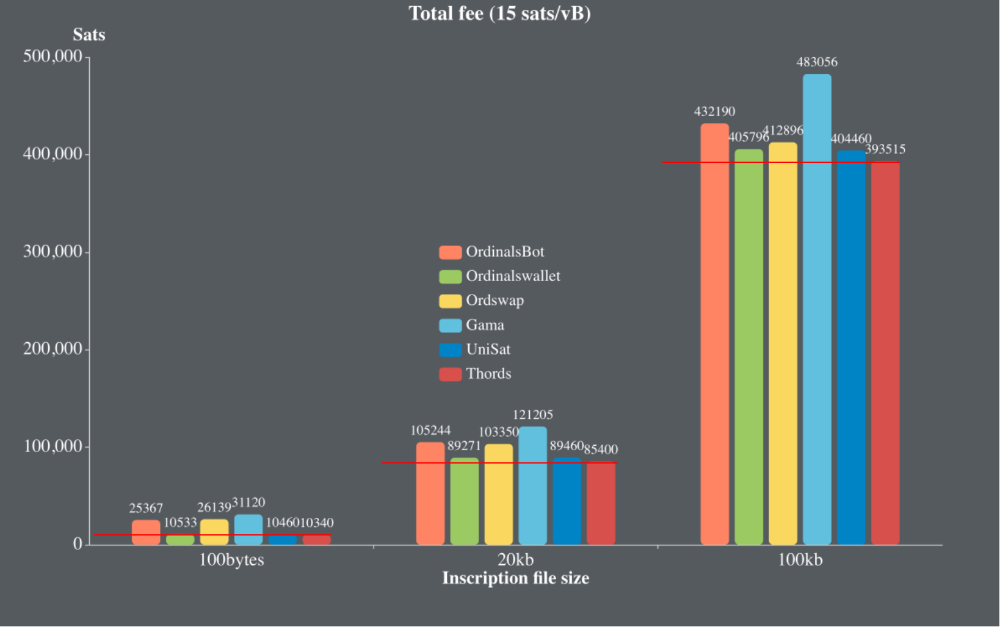
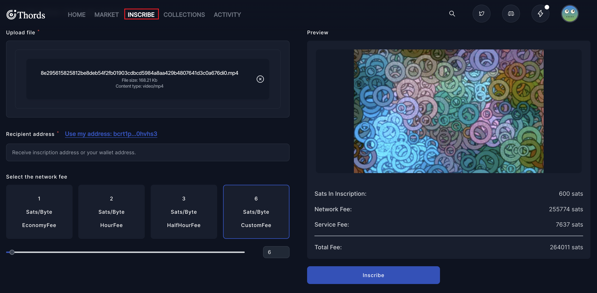
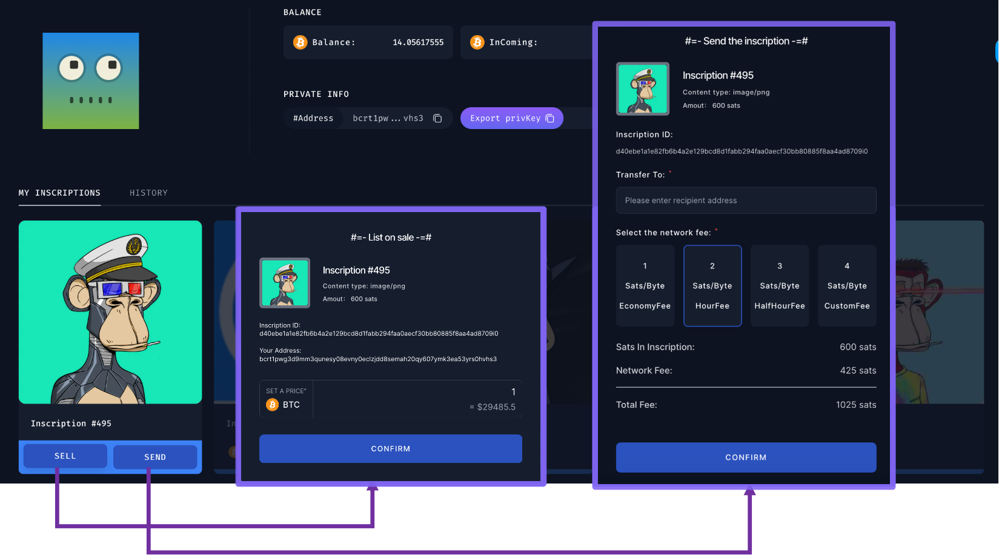
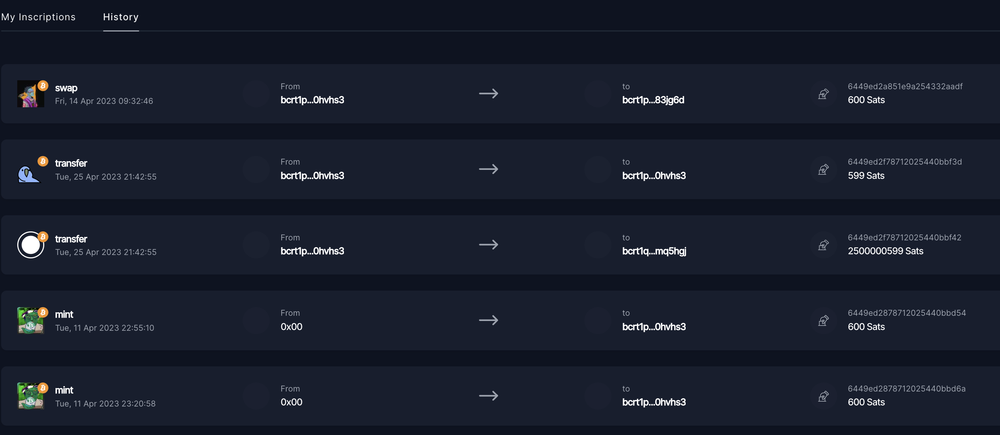
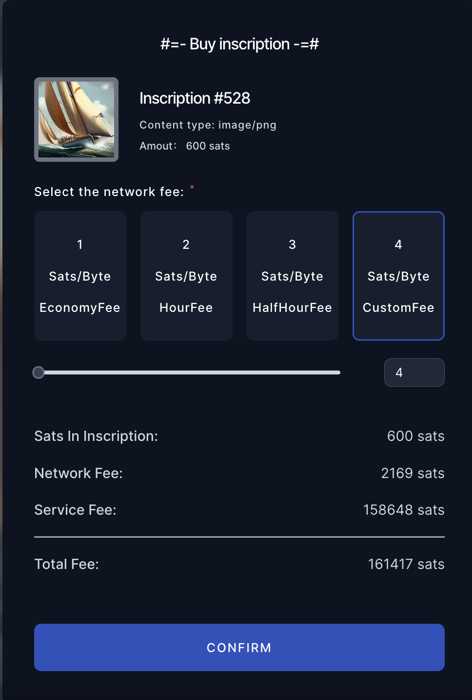
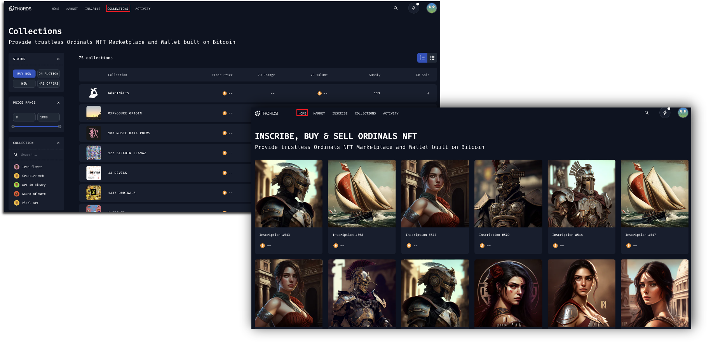
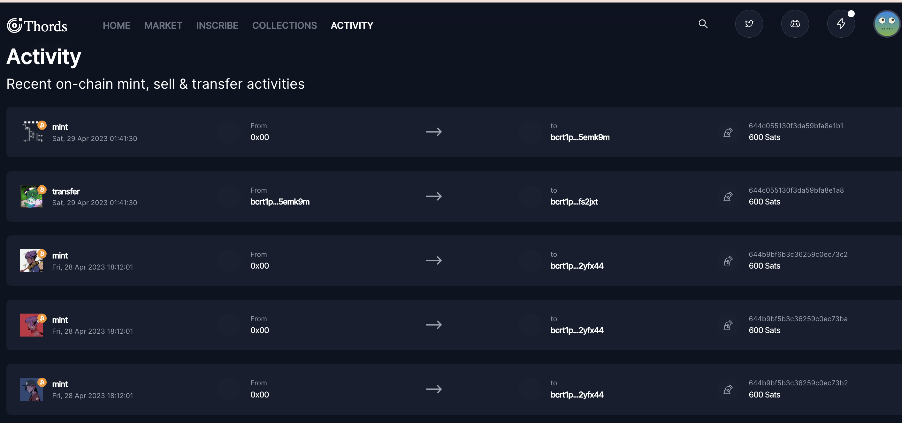
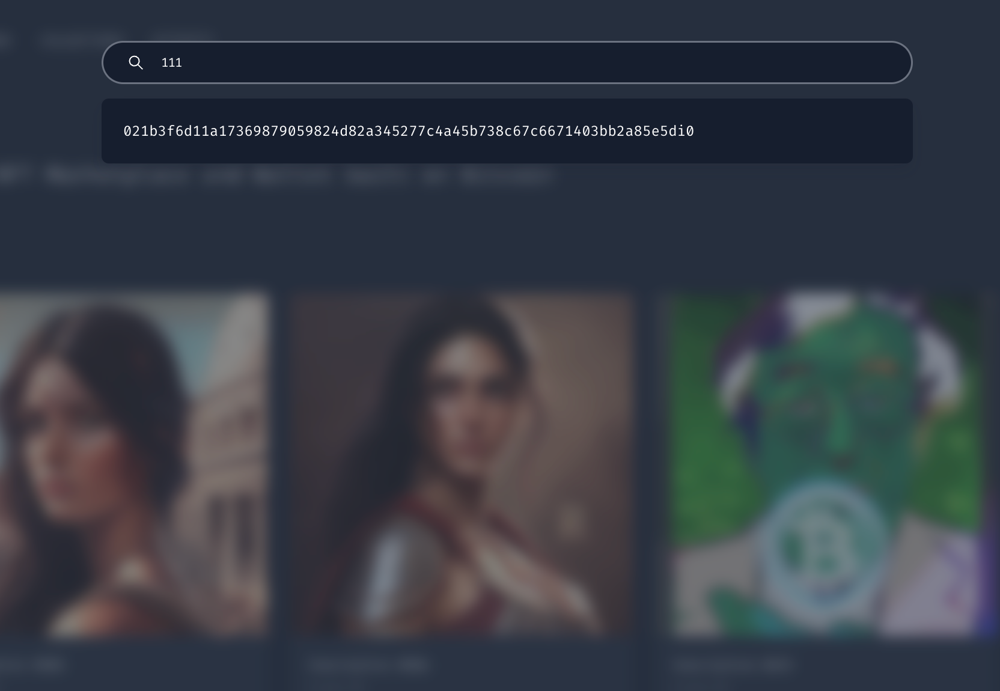
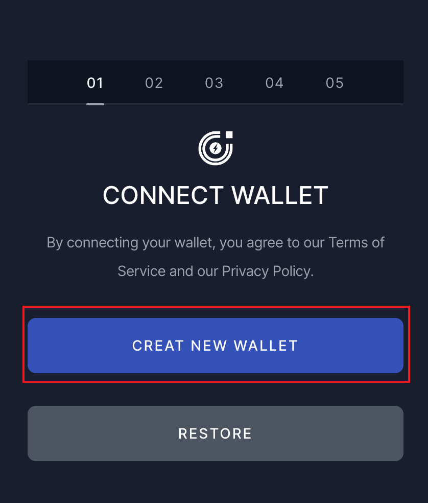
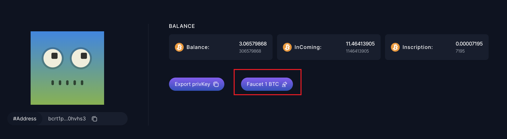

### Key Features
- one of the most cost-effective & secure inscribing service
  + gas fee optimization 
  
  + inscribe by your self, not relying on third-party service
  + custome bitcoin network fee selection
  + set Recipient address on your wish 
  

- fully on-chain inscriptions indexing
  - discover latest, trending collections & inscriptions
  - track top collectors
- sell and send securely
  - Hiding bidder and seller's signatures to prevent it's by baddly used in the future
 
 - view your NFT transaction histories
 

- buy inscriptions with secure and cost-effective experience
  - discover inscription histories
  
  - secure
    - Trust-minimized PSBT combining requiring 0 communication from the seller and buyer.  
    - buyer and seller signature verification 
    - optimized tx structure preventing inscription utxo bloating & lower cost by resue dummy utxos
    - real-time indexing serivice to preventing inscription being spent as cardinal utxo
  - cost-effective 
    - gas fee optimization
    - only 3% commision fee
  
- discover trending collectors and inscriptions with our indexing service
  - discover collections and inscriptions
  
  - trending activities
  
  - search by inscription number or id
  
- Give it a try on our [regtest app](https://app.regtest.thords.io/), it's totally free!
  1. [create a wallet](https://app.regtest.thords.io/create-wallet)

   
  
  2. faucet 1 BTC on your [profile page](https://app.regtest.thords.io/profile)
  
  3. inscribe or buy nfts

